<div align="center">

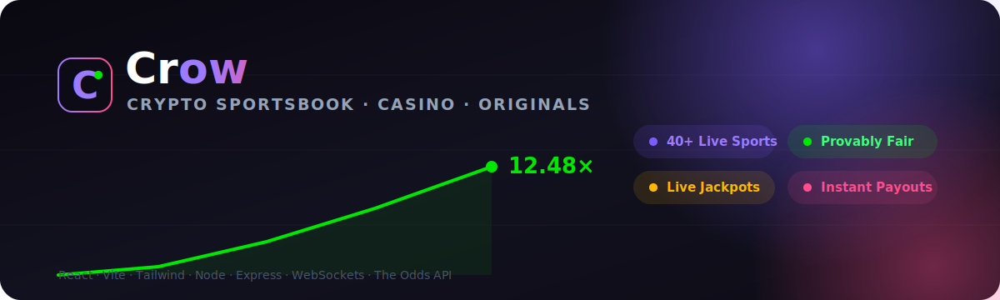

<h1>Crow &nbsp;⚡&nbsp; Crypto Sportsbook · Casino · Originals</h1>

<p><strong>A full-stack crypto betting platform.</strong><br/>
Live sports odds from <a href="https://the-odds-api.com">The Odds API</a>, real-time provably-fair casino games,
a shared community jackpot, and a rewards engine — wrapped in a slick dark-neon UI.</p>

<p>
  
  
  
  
  
  
</p>

<p>
  
  
  
  
  
</p>

</div>

---

> [!IMPORTANT]
> **Crow is a portfolio / educational demo.** It uses **no real money**, ships with a simulated wallet, and is **not affiliated with The Odds API**. The casino games are mathematically modelled and provably fair, but exist purely to demonstrate full-stack engineering. _18+ themed UI._

<br/>

## 📑 Table of Contents

- [✨ Highlights](#-highlights)
- [🖼️ Screenshots](#️-screenshots)
- [🧩 Feature Tour](#-feature-tour)
- [🏗️ Architecture](#️-architecture)
- [🔄 How Live Odds Flow](#-how-live-odds-flow)
- [🎰 Game Engines & State Machine](#-game-engines--state-machine)
- [🛡️ Provably Fair](#️-provably-fair)
- [🚀 Quick Start](#-quick-start)
- [⚙️ Configuration](#️-configuration)
- [📡 API Reference](#-api-reference)
- [🔌 WebSocket Protocol](#-websocket-protocol)
- [🗂️ Project Structure](#️-project-structure)
- [🧰 Tech Stack](#-tech-stack)
- [🗺️ Roadmap](#️-roadmap)
- [📜 License & Disclaimer](#-license--disclaimer)

<br/>

## ✨ Highlights

|  | Feature | What it does |
|--|---------|--------------|
| 🏟️ | **Live Sportsbook** | Real odds for **40+ sports** (soccer, NBA, NFL, NHL, MLB, MMA, tennis…) pulled from The Odds API, with moneyline / spreads / totals markets. |
| 🎟️ | **Parlay Bet Slip** | Add selections across events, auto-calculated combined odds, server-validated stakes & payouts. |
| 🎢 | **Crash** | The signature "rollercoaster" game — a live multiplier curve over WebSockets with manual & auto cash-out. |
| 🎡 | **X-Roulette** | A 15-slot wheel (red / black / 14× green) spinning every 12 seconds for the whole lobby. |
| 💰 | **Community Jackpot** | Players buy into a shared pot; a stake-weighted, provably-fair draw picks the winner. |
| 🎲 | **Dice** | Instant provably-fair dice with an adjustable win-chance slider and 99% RTP. |
| 🎁 | **Rewards Engine** | XP, levels, instant rakeback, daily spins, weekly cashback and a live wager race. |
| 🛡️ | **Provably Fair** | SHA-256 commit/reveal + HMAC seed derivation shared across all original games. |
| 📺 | **Live Wins Ticker** | A real-time marquee of wins across the platform, pushed over WebSockets. |
| 🔌 | **Zero-config Mock Mode** | No API key? The server serves deterministic, realistically-shaped odds so everything just works offline / in CI. |

<br/>

## 🖼️ Screenshots

> The UI is a single-page React app styled with Tailwind — dark `#0d0c16` canvas, neon purple/green/pink accents, glassy panels and glow shadows.

### 🏠 Home / Lobby
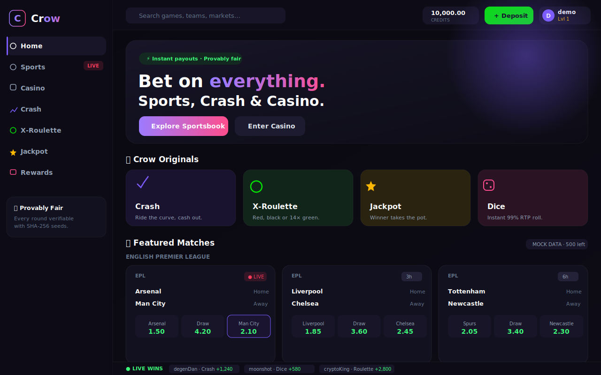

### 🏟️ Sportsbook
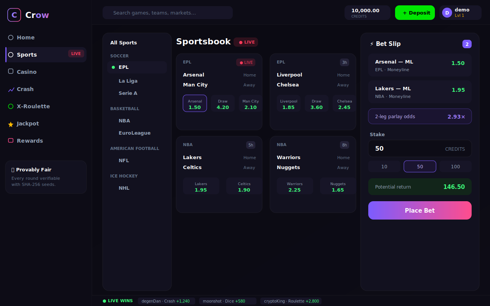

### 🎢 Crash
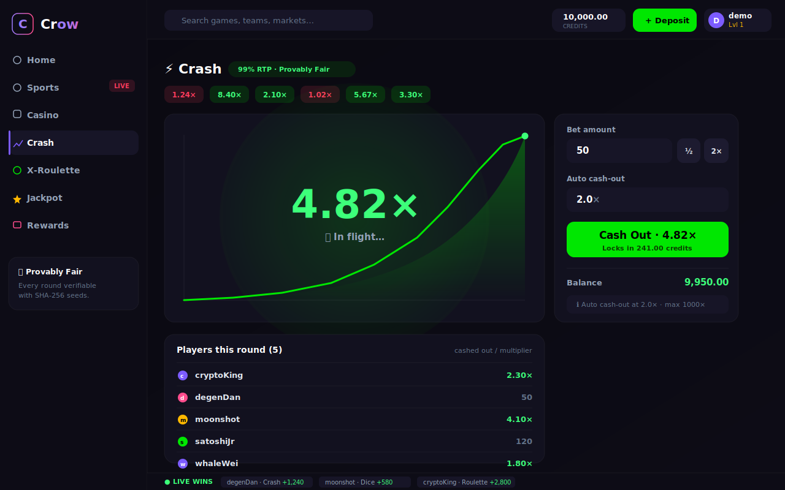

<table>
<tr>
<td width="50%"><strong>🎡 X-Roulette</strong><br/>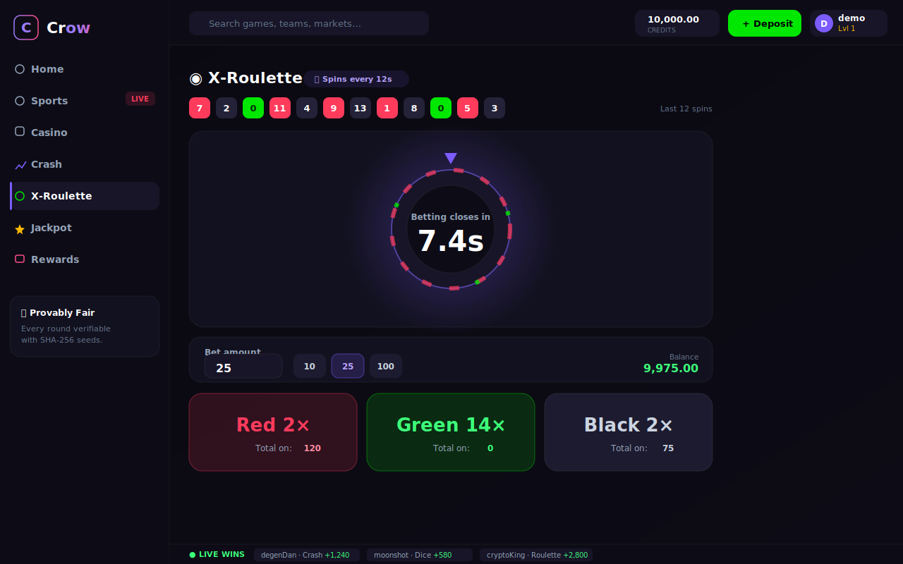</td>
<td width="50%"><strong>💰 Jackpot</strong><br/>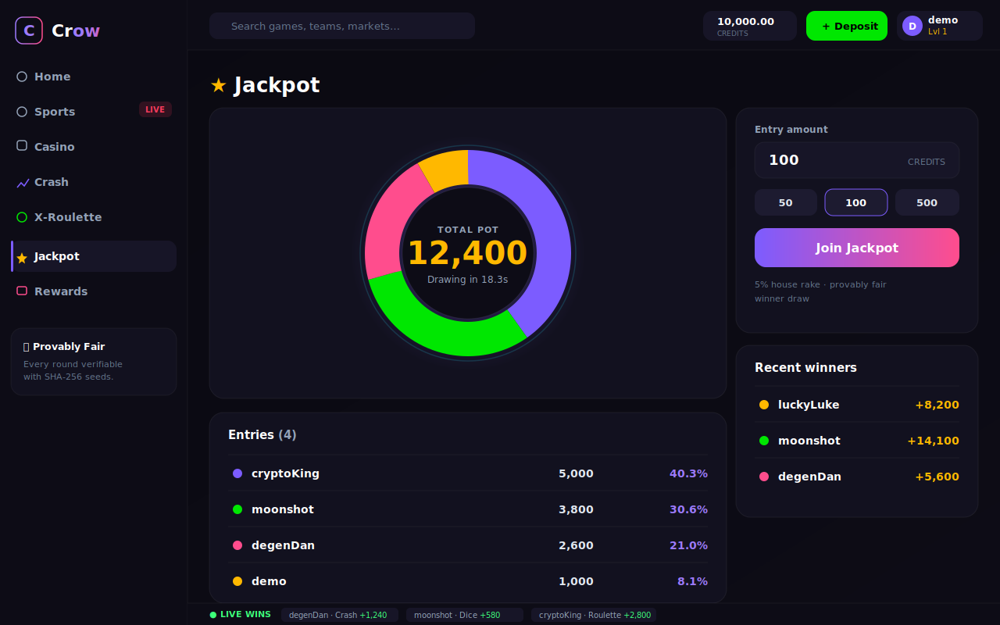</td>
</tr>
<tr>
<td width="50%"><strong>🎮 Casino Lobby</strong><br/>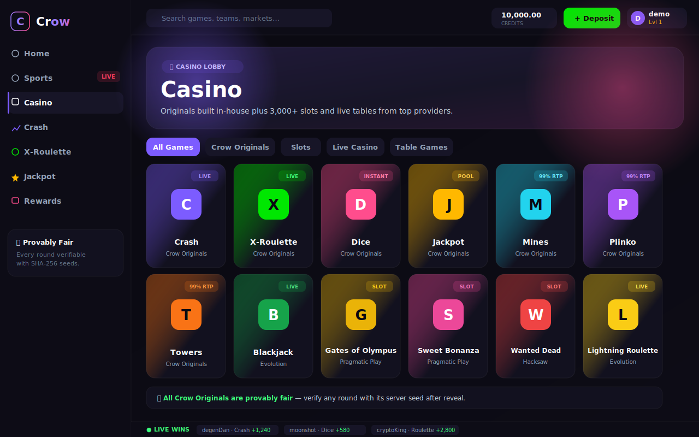</td>
<td width="50%"><strong>🎁 Rewards</strong><br/>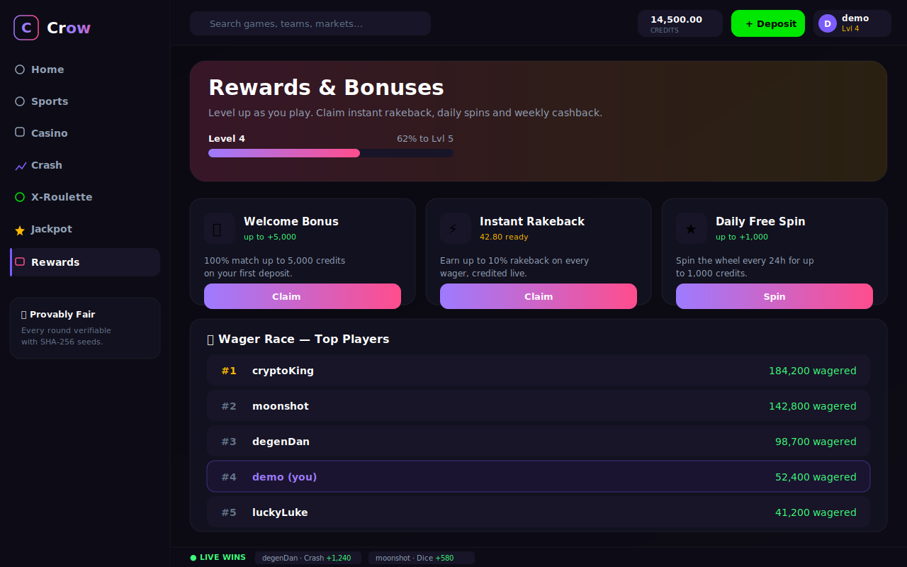</td>
</tr>
</table>

<br/>

## 🧩 Feature Tour

<details>
<summary><strong>🏟️ Sportsbook & Bet Slip</strong></summary>

- Sports are grouped by category in a sticky left rail; selecting one fetches its odds on demand.
- Each **event card** renders the first bookmaker offering the `h2h` market and exposes one-tap odds buttons.
- Tapping odds adds a **leg** to the global bet slip (Zustand store). One selection per market per event.
- Multi-leg slips become a **parlay** — combined odds are the product of all legs.
- On **Place Bet**, the server re-computes odds & potential return (never trusting the client), debits the stake, and auto-settles the bet after a short delay using a probability implied by the odds.
</details>

<details>
<summary><strong>🎢 Crash ("Rollercoaster")</strong></summary>

- A single server-side engine drives the round for **every connected player**.
- Lifecycle: `betting (5s) → running → crashed (3.5s) → repeat`, broadcast over the `crash` WS channel.
- The multiplier climbs on an exponential curve; the **bust point is pre-committed** via HMAC before betting opens.
- Players can **auto cash-out** at a target multiplier or bail manually mid-flight.
- Round history shows the last busts with their revealed server seeds.
</details>

<details>
<summary><strong>🎡 X-Roulette</strong></summary>

- 15 slots: slot `0` is the green **14×** jackpot; the rest alternate red/black at **2×**.
- Bet **red / black / green**; the wheel spins lobby-wide every 12 seconds.
- The winning slot = `HMAC(serverSeed, clientSeed:nonce) mod 15`.
</details>

<details>
<summary><strong>💰 Jackpot & 🎲 Dice</strong></summary>

- **Jackpot:** players buy tickets into a shared pot; a 30s countdown starts on the first entry. The winner is drawn with probability proportional to stake (5% house rake). The pie chart visualises everyone's win chance live.
- **Dice:** pick a target (2–98) and roll over/under. Win chance, multiplier (1% edge) and payout update live; each roll returns its `hash` + `serverSeed` for verification.
</details>

<details>
<summary><strong>🎁 Rewards Engine</strong></summary>

- Every credit wagered earns **XP**; levels are awarded per 1,000 XP and surfaced on the avatar.
- **Instant rakeback** accrues on every wager and can be claimed to balance at any time.
- Welcome bonus, daily free spin and weekly cashback are claimable cards.
- A **wager race** leaderboard ranks the top players (you're slotted in by XP).
</details>

<br/>

## 🏗️ Architecture

Crow is a **monorepo** (npm workspaces) with a React SPA talking to a Node API over REST + a single multiplexed WebSocket. Game state lives in in-memory engines; sports data comes from The Odds API behind a quota-protecting cache with a deterministic mock fallback.

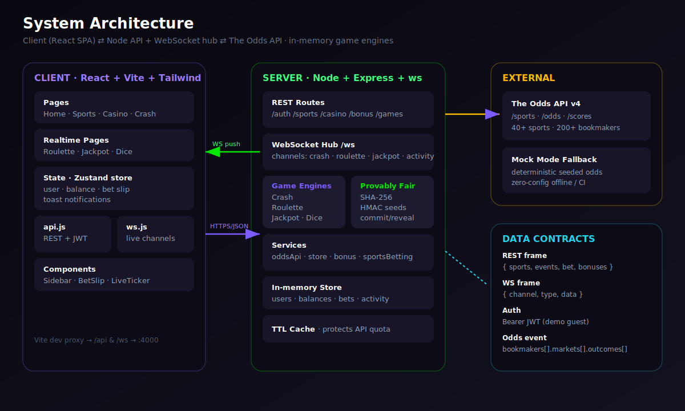

**Design principles**

- **One source of truth per concern** — every read/write goes through a `services/*` module, so swapping the in-memory store for Postgres/Redis touches one file.
- **Identical data shapes** in live and mock mode, so no code path is "demo only."
- **Server-authoritative money** — stakes, odds and payouts are always recomputed on the server.
- **Push, don't poll** — game and ticker updates are streamed; the client never spins.

<br/>

## 🔄 How Live Odds Flow

A single `/api/featured` call fans out across configured sports, each cached independently so a busy lobby costs **one upstream credit per sport per TTL window** — not one per visitor.

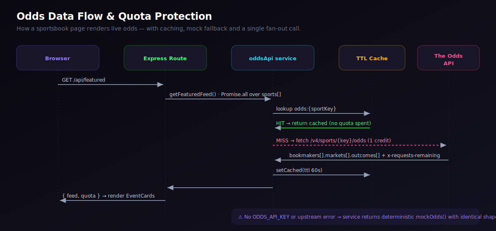

<br/>

## 🎰 Game Engines & State Machine

Each original game is an `EventEmitter` running its own clock on the server. Transitions emit a `{ channel, type, data }` frame that the WebSocket hub fans out to every subscriber.

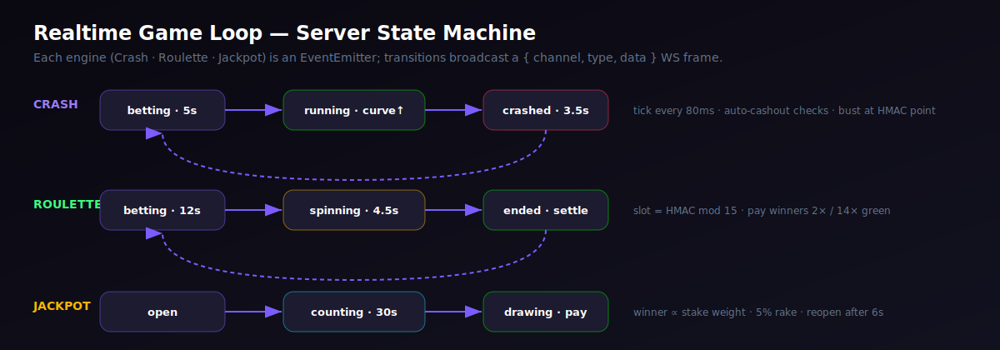

<br/>

## 🛡️ Provably Fair

All original games use a **commit-and-reveal** scheme so any outcome can be verified to have been fixed *before* bets were placed.

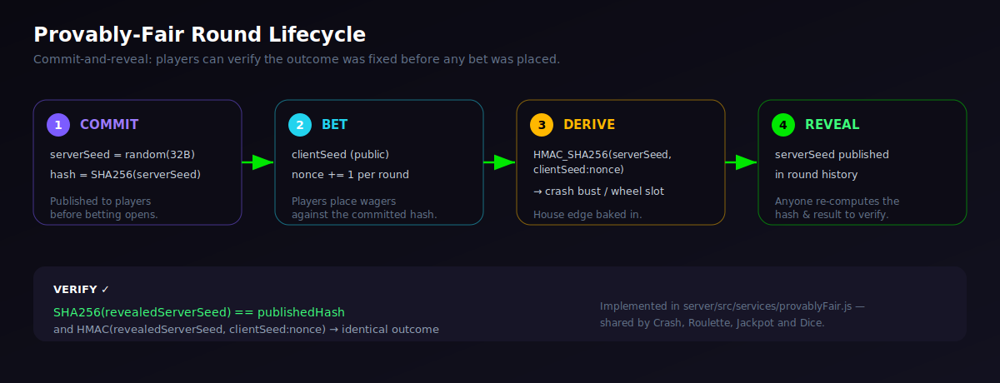

```js
// server/src/services/provablyFair.js  (simplified)
const serverSeed = crypto.randomBytes(32).toString('hex');
const commitment = sha256(serverSeed);                 // 1. published BEFORE the round
// … players bet against `commitment` …
const h = hmacSha256(serverSeed, `${clientSeed}:${nonce}`);
const outcome = deriveOutcome(h);                      // 3. crash bust / wheel slot / dice roll
// 4. serverSeed revealed in history → anyone checks sha256(serverSeed) === commitment
```

<br/>

## 🚀 Quick Start

> **Prerequisites:** Node.js **20+** and npm 10+.

```bash
# 1. Install all workspaces (root, server, client)
npm install

# 2. Create your env file (works immediately in MOCK mode — no key needed)
cp .env.example .env

# 3. Run the API + the Vite dev server together
npm run dev
```

| Service | URL |
|---------|-----|
| 🖥️ **Client (Vite)** | http://localhost:5173 |
| ⚙️ **API** | http://localhost:4000/api |
| 🔌 **WebSocket** | ws://localhost:4000/ws |

That's it — open the client and you're auto-logged-in as a **guest with 10,000 demo credits**. The Vite dev server proxies `/api` and `/ws` to the backend, so there's nothing else to wire up.

### Going live with real odds

1. Grab a free key at **[the-odds-api.com](https://the-odds-api.com)** (500 requests/month on the free tier).
2. Put it in `.env`: `ODDS_API_KEY=your_key_here`
3. Restart — the server boots in **LIVE** mode and the homepage shows your remaining API credits.

```bash
npm run seed   # optional: ping a running server and print a health/feed summary
npm run build  # production build of the client into client/dist
npm start      # serve the API in production mode
```

<br/>

## ⚙️ Configuration

All configuration lives in `.env` (see [`.env.example`](.env.example)):

| Variable | Default | Description |
|----------|---------|-------------|
| `ODDS_API_KEY` | _(empty)_ | The Odds API key. **Empty → mock mode.** |
| `ODDS_REGIONS` | `us,uk,eu` | Bookmaker regions to request. |
| `ODDS_MARKETS` | `h2h,spreads,totals` | Markets to request. |
| `ODDS_FORMAT` | `decimal` | `decimal` or `american`. |
| `ODDS_SPORTS` | `soccer_epl,basketball_nba,…` | Sports surfaced on the homepage feed. |
| `ODDS_CACHE_TTL` | `60` | Seconds to cache odds responses (quota protection). |
| `PORT` | `4000` | API/WS port. |
| `JWT_SECRET` | `change-me…` | Secret for the demo session tokens. |
| `STARTING_BALANCE` | `10000` | Credits granted to each new player. |

<br/>

## 📡 API Reference

Base URL: `http://localhost:4000/api` · Auth: `Authorization: Bearer <jwt>` where noted (🔒).

### Auth
| Method | Endpoint | Description |
|--------|----------|-------------|
| `POST` | `/auth/guest` | Create/resume a demo session → `{ token, user }`. |
| `GET` | `/auth/me` 🔒 | Current user & balance. |

### Sports
| Method | Endpoint | Description |
|--------|----------|-------------|
| `GET` | `/sports` | List available sports + quota. |
| `GET` | `/featured` | Curated multi-sport homepage feed. |
| `GET` | `/sports/:sportKey/odds` | Odds for one sport. |
| `POST` | `/bets` 🔒 | Place a (parlay) bet `{ legs[], stake }`. |
| `GET` | `/bets` 🔒 | Your recent bets. |

### Casino & Games
| Method | Endpoint | Description |
|--------|----------|-------------|
| `GET` | `/casino/games` | Lobby catalog + categories. |
| `GET` | `/casino/activity` | Recent wins feed. |
| `POST` | `/casino/dice` 🔒 | Roll dice `{ wager, target, direction }`. |
| `GET` | `/games/crash/state` | Current crash snapshot. |
| `POST` | `/games/crash/bet` 🔒 | Join the crash round `{ wager, autoCashout? }`. |
| `POST` | `/games/crash/cashout` 🔒 | Cash out the active flight. |
| `POST` | `/games/roulette/bet` 🔒 | Bet a colour `{ color, amount }`. |
| `POST` | `/games/jackpot/enter` 🔒 | Buy into the pot `{ amount }`. |

### Bonus
| Method | Endpoint | Description |
|--------|----------|-------------|
| `GET` | `/bonus` 🔒 | List bonuses & rakeback balance. |
| `POST` | `/bonus/:id/claim` 🔒 | Claim a bonus / rakeback. |

<details>
<summary><strong>Example — place a 2-leg parlay</strong></summary>

```bash
TOKEN=$(curl -s -X POST localhost:4000/api/auth/guest -H 'Content-Type: application/json' -d '{}' | jq -r .token)

curl -s -X POST localhost:4000/api/bets \
  -H "Authorization: Bearer $TOKEN" -H 'Content-Type: application/json' \
  -d '{
        "legs": [
          { "eventId": "soccer_epl-0", "label": "Arsenal — ML", "price": 1.50, "market": "Moneyline" },
          { "eventId": "basketball_nba-1", "label": "Lakers — ML", "price": 1.95, "market": "Moneyline" }
        ],
        "stake": 50
      }' | jq
# → { "bet": { "odds": 2.93, "potentialReturn": 146.25, "status": "open", ... } }
```
</details>

<br/>

## 🔌 WebSocket Protocol

One endpoint, `ws://<host>/ws`, multiplexed by channel. Subscribe, then receive typed frames:

```js
const ws = new WebSocket('ws://localhost:4000/ws');
ws.onopen = () => ws.send(JSON.stringify({ type: 'subscribe', channel: 'crash' }));
ws.onmessage = (e) => {
  const { channel, type, data } = JSON.parse(e.data);
  // channel: crash | roulette | jackpot | activity
  // type:    state | tick | cashout | win | feed
};
```

| Channel | Frame types | Payload |
|---------|-------------|---------|
| `crash` | `state`, `tick`, `cashout` | multiplier, players, history, bust |
| `roulette` | `state`, `win` | wheel state, result slot, bets, history |
| `jackpot` | `state` | pot, entries (with live %), winner, history |
| `activity` | `feed` | rolling list of recent wins (pushed every 3s) |

On subscribe the hub immediately sends the **current snapshot**, so a freshly-loaded page is instantly in sync.

<br/>

## 🗂️ Project Structure

```
Sports-Betting-Project/
├── README.md
├── package.json                 # npm workspaces + dev scripts
├── .env.example
├── docs/assets/                 # SVG diagrams + UI mockups (this README)
│
├── server/                      # Node + Express + ws
│   └── src/
│       ├── index.js             # app bootstrap, routes, WS, game loops
│       ├── config.js            # env parsing, mock-mode toggle
│       ├── routes/              # auth · sports · casino · bonus · games
│       ├── services/            # oddsApi · store · bonus · sportsBetting · provablyFair
│       ├── games/               # crash · roulette · jackpot · dice engines
│       ├── middleware/auth.js   # JWT guard
│       └── ws/hub.js            # channel fan-out
│
└── client/                      # React + Vite + Tailwind
    └── src/
        ├── App.jsx              # shell + router
        ├── lib/                 # api.js (REST) · ws.js (reconnecting socket)
        ├── store/useStore.js    # Zustand global state
        ├── components/          # Sidebar · TopBar · BetSlip · LiveTicker · EventCard …
        └── pages/               # Home · Sports · Casino · Crash · Roulette · Jackpot · Dice · Bonus
```

<br/>

## 🧰 Tech Stack

| Layer | Technology |
|-------|-----------|
| **Frontend** | React 18, Vite 5, Tailwind CSS 3, Zustand, React Router, Framer Motion |
| **Backend** | Node 20, Express 4, `ws`, JSON Web Tokens |
| **Realtime** | Native WebSockets, server-side `EventEmitter` game engines |
| **Data** | The Odds API v4 (live) with deterministic mock fallback |
| **Fairness** | Node `crypto` — SHA-256 commitments + HMAC-SHA256 derivation |
| **Tooling** | npm workspaces, `concurrently`, Vite dev proxy |

<br/>

## 🗺️ Roadmap

- [ ] Persistent storage (Postgres + Prisma) behind the existing `store` interface
- [ ] Real auth (email / OAuth / wallet connect) replacing the demo guest token
- [ ] Live score settlement via The Odds API `/scores` endpoint
- [ ] More originals: Mines, Plinko, Towers (tiles already in the lobby)
- [ ] On-chain provably-fair verification page (paste seed → recompute outcome)
- [ ] Cash-out for open sports bets & live in-play markets
- [ ] Mobile PWA polish + push notifications for jackpot draws

<br/>

## 📜 License & Disclaimer

Released under the **[MIT License](LICENSE)**.

**Disclaimer:** Crow is a non-commercial portfolio demonstration of full-stack and real-time engineering. It involves **no real currency**, is **not a gambling service**, and is **not affiliated with, endorsed by, or connected to The Odds API**. All teams, odds and outcomes in mock mode are fictional. If you build on this, gambling is heavily regulated — obtain the appropriate licensing and never ship real-money play without it. **18+. Play responsibly.**

<div align="center">
<br/>
<sub>Built with ⚡ as a demonstration of live odds, realtime games, and provably-fair design.</sub>
</div>
