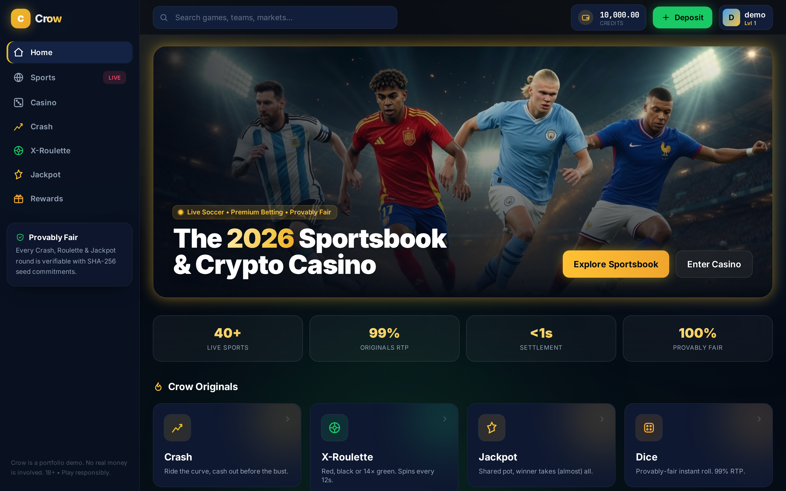
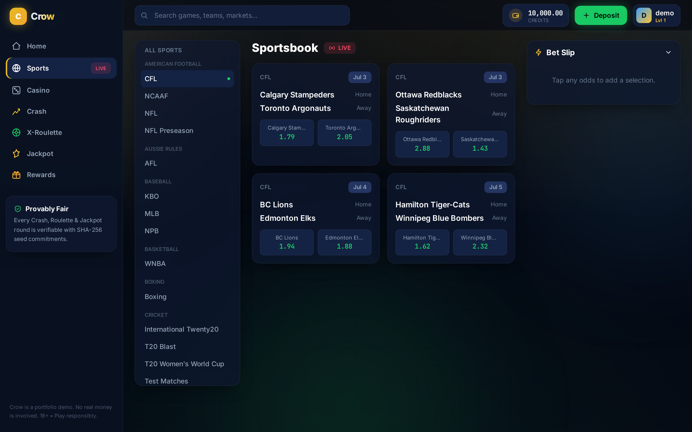
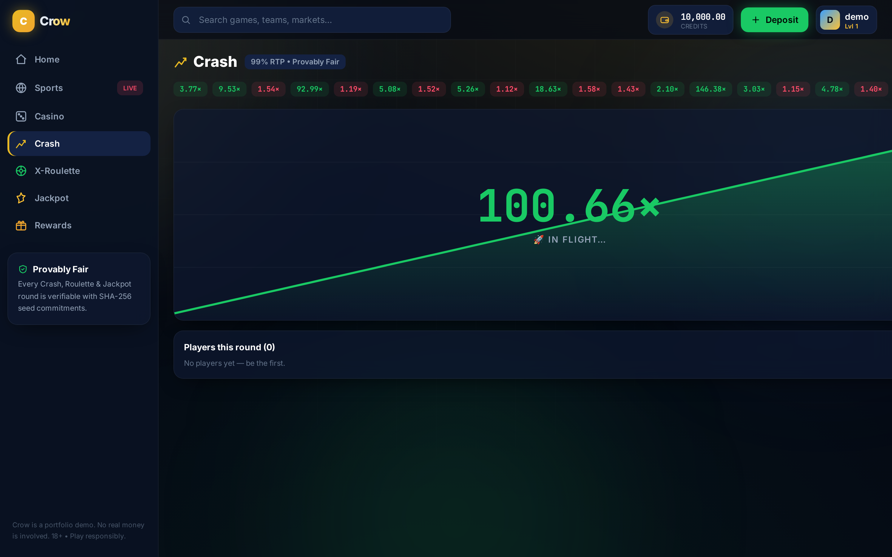
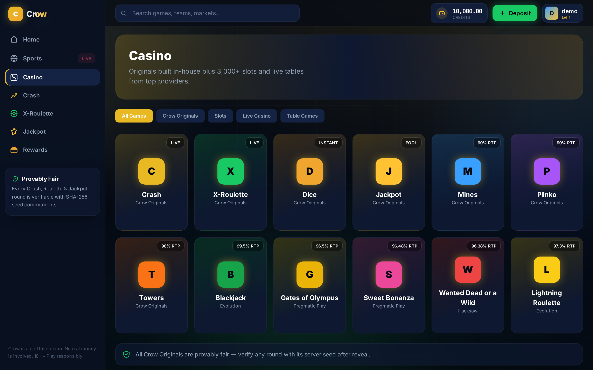
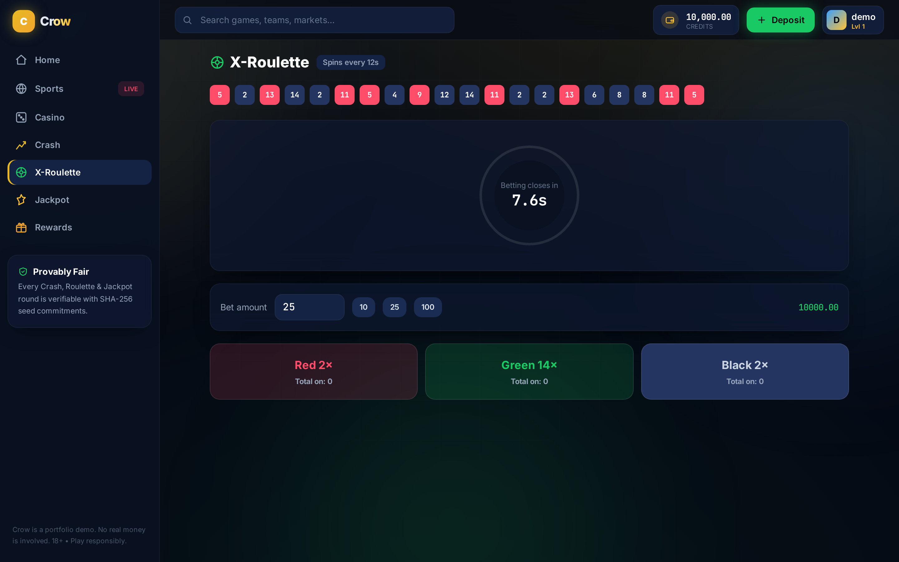
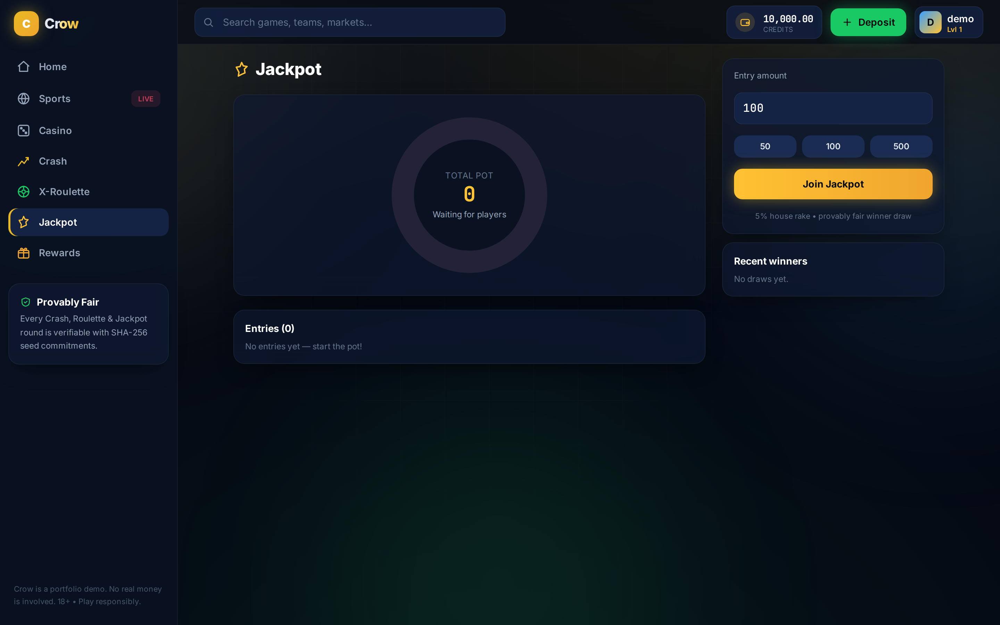
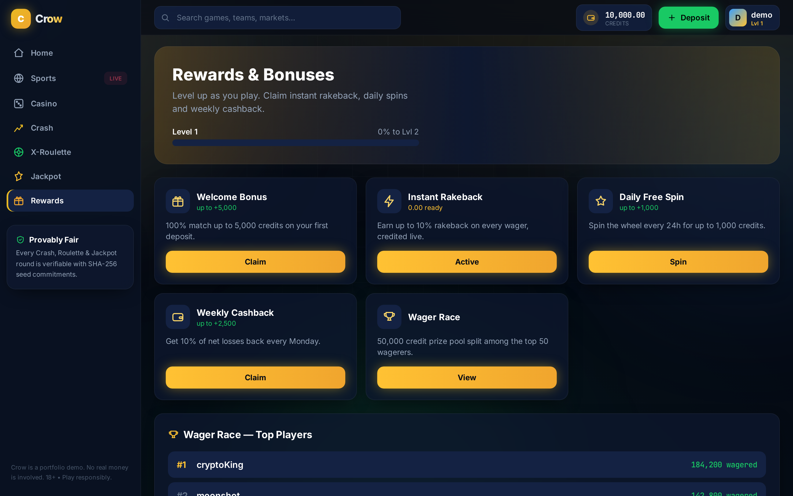
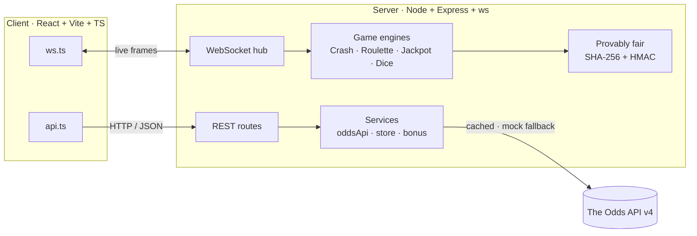
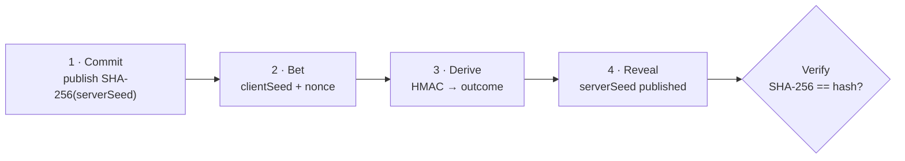

# Crow

A crypto sportsbook and casino, built as a full-stack demo. It pulls live sports
odds from [The Odds API](https://the-odds-api.com) and adds four in-house,
provably-fair games — Crash, Roulette, Jackpot and Dice — that run in real time
over WebSockets. React + TypeScript on the front end, Node + TypeScript on the back.

> Portfolio/demo project. Play money only, no real wagering, not affiliated with any
> operator or with The Odds API. 18+.



---

## What's inside

- **Sportsbook** — live odds for 40+ sports (moneyline, spreads, totals) with a
  parlay bet slip; stakes and payouts are validated on the server.
- **Crash** — a shared multiplier that climbs until it busts; cash out manually or
  set an auto-cashout.
- **X-Roulette** — a 15-slot wheel (red / black / 14× green) that spins for the whole
  lobby every 12 seconds.
- **Jackpot** — players buy into one pot; the winner is drawn with probability
  proportional to their stake.
- **Dice** — instant rolls with an adjustable win chance.
- **Rewards** — XP and levels, live rakeback, daily/weekly bonuses, and a wager race.
- **Provably fair** — every original round commits to a SHA-256 hash up front and
  reveals the seed afterwards, so outcomes can be verified.
- **No API key needed** — without one, the server serves deterministic mock odds in
  the exact shape of the real API, so everything works offline.

## Screenshots

| Sportsbook | Crash |
| --- | --- |
|  |  |

| Casino | X-Roulette |
| --- | --- |
|  |  |

| Jackpot | Rewards |
| --- | --- |
|  |  |

## Tech

- **Front end:** React 18, Vite, TypeScript, Tailwind CSS, Zustand, Framer Motion
- **Back end:** Node 20, Express, `ws`, TypeScript (run with `tsx`)
- **Data:** The Odds API v4, with a built-in mock fallback
- **Fairness:** Node `crypto` — SHA-256 commitments + HMAC-SHA256 outcomes
- Monorepo via npm workspaces; shared API/WebSocket types in `shared/types.ts`

## Getting started

Requires Node 20+.

```bash
npm install
cp .env.example .env     # works out of the box in mock mode
npm run dev              # client on :5173, API on :4000
```

Open <http://localhost:5173>. You're signed in automatically as a guest with demo
credits.

To use real odds, get a free key at [the-odds-api.com](https://the-odds-api.com) and
set `ODDS_API_KEY` in `.env`, then restart.

For a production-style run (one port, server serves the built client):

```bash
npm run build
npm start                # everything on http://localhost:4000
```

Other scripts: `npm run typecheck` (whole monorepo), `npm run seed` (quick API
smoke test), `node scripts/screenshots.mjs` (regenerate the screenshots above).

## How it works



**Live odds.** The home feed fans out across the configured sports in one request.
Each sport's odds are cached for a short TTL, so a busy lobby costs one upstream
credit per sport per window rather than one per visitor. If a key is missing or a
request fails, the same call returns deterministic mock data of the identical shape.

**Real-time games.** Each original is an `EventEmitter` running its own clock on the
server. State transitions are pushed to subscribers over a single multiplexed
WebSocket as `{ channel, type, data }` frames (`crash`, `roulette`, `jackpot`,
`activity`).

**Provably fair.** Commit-and-reveal: the server publishes `SHA-256(serverSeed)`
before betting, derives the outcome from `HMAC(serverSeed, clientSeed:nonce)`, then
reveals `serverSeed` so anyone can re-check it.



## Project structure

```
.
├── shared/types.ts          # API + WebSocket types shared by client and server
├── server/                  # Node + Express + ws (TypeScript)
│   └── src/
│       ├── index.ts         # bootstrap, routes, WS, game loops
│       ├── routes/          # auth · sports · casino · bonus · games
│       ├── services/        # oddsApi · store · bonus · sportsBetting · provablyFair
│       ├── games/           # crash · roulette · jackpot · dice
│       └── ws/hub.ts        # channel fan-out
└── client/                  # React + Vite + Tailwind (TypeScript)
    └── src/
        ├── lib/             # api.ts · ws.ts
        ├── store/           # Zustand store
        ├── components/      # Sidebar · TopBar · BetSlip · LiveTicker · …
        └── pages/           # Home · Sports · Casino · Crash · Roulette · Jackpot · Dice · Bonus
```

## API quick reference

Base `http://localhost:4000/api`. Endpoints marked 🔒 need `Authorization: Bearer <jwt>`.

| Method | Endpoint | Purpose |
| --- | --- | --- |
| `POST` | `/auth/guest` | Start a demo session |
| `GET` | `/featured` | Multi-sport homepage feed |
| `GET` | `/sports/:key/odds` | Odds for one sport |
| `POST` | `/bets` 🔒 | Place a (parlay) bet |
| `GET` | `/casino/games` | Casino lobby |
| `POST` | `/casino/dice` 🔒 | Roll dice |
| `POST` | `/games/crash/bet` 🔒 | Join the crash round |
| `POST` | `/games/jackpot/enter` 🔒 | Enter the jackpot |
| `GET` | `/bonus` 🔒 | Bonuses & rakeback |

## Contact

Telegram — [@Kei4650](https://t.me/Kei4650)

## License

MIT — see [LICENSE](LICENSE). This is a non-commercial demonstration with no real
money and no affiliation with The Odds API or any betting brand. Gambling is heavily
regulated; don't deploy real-money play without the proper licensing.
